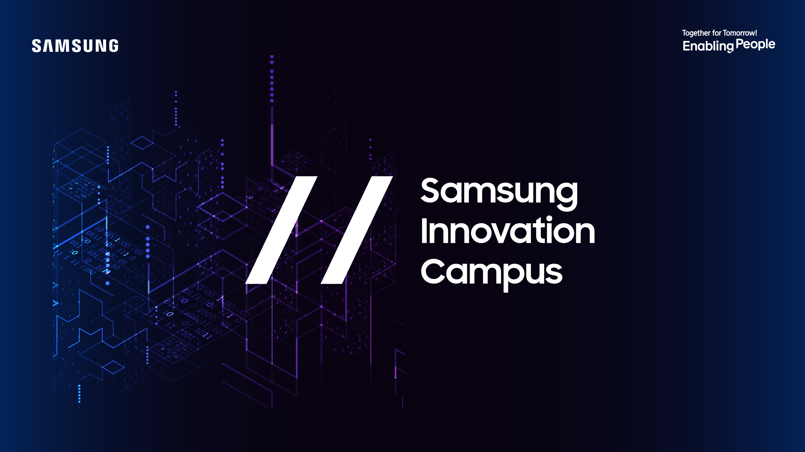

# Samsung Innovation Campus - Coding & Programming with Python
This repository contains exercises proposed by Samsung or in class exercises (started on July 1st)

Written by Penh Polydet

## Stars 🌟

